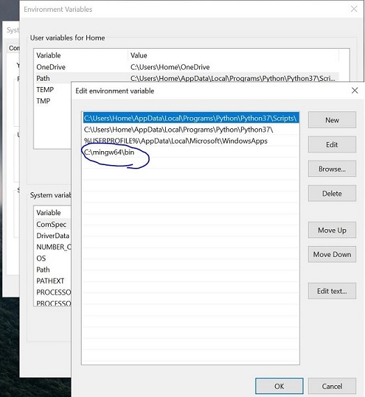

[](https://github.com/immehulsolanki/olcPixelGameEngineVSCode/blob/master/README.md) [](https://github.com/immehulsolanki/olcPixelGameEngineVSCode) [](https://isocpp.org/) 

# What is olcPixalGameEngine?

The official distribution of olcPixelGameEngine, a tool used in user javidx9's C++ tutorial YouTube videos and projects.
You only need the one file - olcPixelGameEngine.h - included in your project!
Provides a fast, richly featured, cross platform pixel drawing and user interface framework for
- The development of games
- Visualization of algorithms
- Prototyping and experimentation
- Education
- Handcrafted C++ GUI

Reference: https://github.com/OneLoneCoder/olcPixelGameEngine

# olcPixalGameEngine with VSCode [Windows10]:
**Requirement:**
1. Latest VSCode for Windows [Download](https://code.visualstudio.com/)
2. Latest MinGW from Winlibs with atleast **GCC version 10.2.x** [Download](http://winlibs.com/)

Note: This setup is tested with "GCC 10.2.0 + LLVM/Clang/LLD/LLDB 11.0.0 + MinGW-w64 8.0.0 - release 3" on Windows10 machine updated as on 18 November 2020.

It is assumed that the version of mingw you are using has the following Windows libs included:
- user32 
- gdi32 
- opengl32 
- gdiplus 
- Shlwapi 
- dwmapi 
- stdc++fs

You are not supposed to find this libs manually it comes with the compiler it self, So dont worry about it yet!

**Configuration Steps:**

- **step1**: Install VSCode as normal software installtion, no special steps required.
- **step2**: Open VSCode and press **ctrl+shft+x** and install *C/C++ extension by Microsoft*.

- **step2**: Winlibs Mingw comes with compressed file type, its stand alone prebuilt binary within single folder. No installation required, just copy and past it.
- **step3**: Extract xxmingwxx.7z and you will get **mingw** folder along with all the necessory files, so now copy **mingw** folder to **C:/** drive manually.

- **step4**: Set windows environment variable path which points compiler as "C:\mingw64\bin"

- **step5**: Restart PC.
- **step6**: open widows terminal and type **gcc --version** it should give ouput as its installed version no.


**Compiling Steps:**

- **step1**: Clone/Download this repository, which includes all VScode configurations + PGE header and sample program.

- **step2**: Verify that you got **.vscode** folder with cloned or downloaded repository contents.
- **step3**: Open VScode
- **step4**: In VScode **Home** select File > Open Folder > and select this downloaded repository folder
- **step5**: Open olcExampleProgram.cpp file with double click on it.
- **step6**: press "ctrl+shft+b"
- **step7**: You will get **.exe** named olcExampleProgram.exe in same directory
- **step8**: Run it in terminal with **./olcExampleProgram.exe** command, it should run.
Done!

If you are already experianced with VSCode IDE, then simply copy and past contents from:
1_c_cpp_properties.json
2_tasks.json
files and modify it as per your convenience.

## Manual with Terminal:
You can also compile PGE in MS terminal as well as VSCode terminal by following method.
You must place both
olcExampleProgram.cpp
olcPixalGameEngine.h
in **same folder** and run following command in MS Terminal or VScode Terminal:

```g++ -std=c++17 olcExampleProgram.cpp -luser32 -lgdi32 -lopengl32 -lgdiplus -lShlwapi -ldwmapi -lstdc++fs```

You will get the following O/P:

```
D:\ADesktop\vsCppWorkSpace\cpppge>g++ -std=c++17 olcExampleProgram.cpp -luser32 -lgdi32 -lopengl32 -lgdiplus -lShlwapi -ldwmapi -lstdc++fs

D:\ADesktop\vsCppWorkSpace\cpppge>a.exe
```
You should now able to see the output of sample program.
Done!